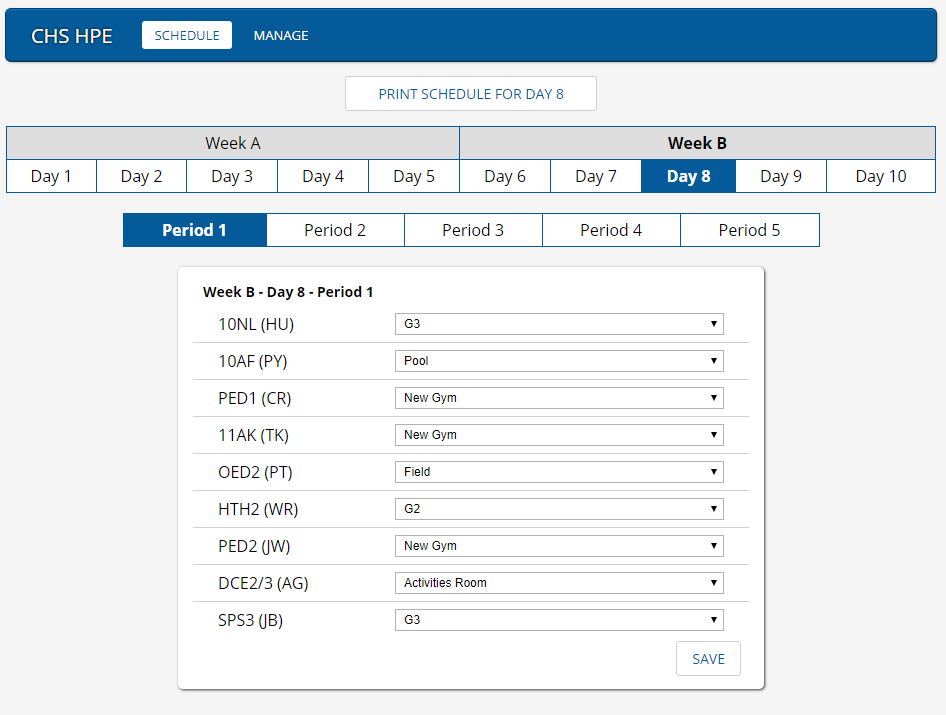

Cambridge High School HPE Timetable Server
==========================================

Server management console written in Node using MongoDB for Cambridge High School, NZ to allow students to quickly recieve information about the location of the Health and Physical Education classes.

Pairs with [CHSHPE-Client](https://github.com/MBRobertson/CHSPE-Client)

Quick start
-----------
- Make sure Node and npm are installed
- Fill out api/config/settings.js with relevant information
- Build using webpack `npm run build`
- Start a local server to view in browser `npm start`

Screenshot
-----------
